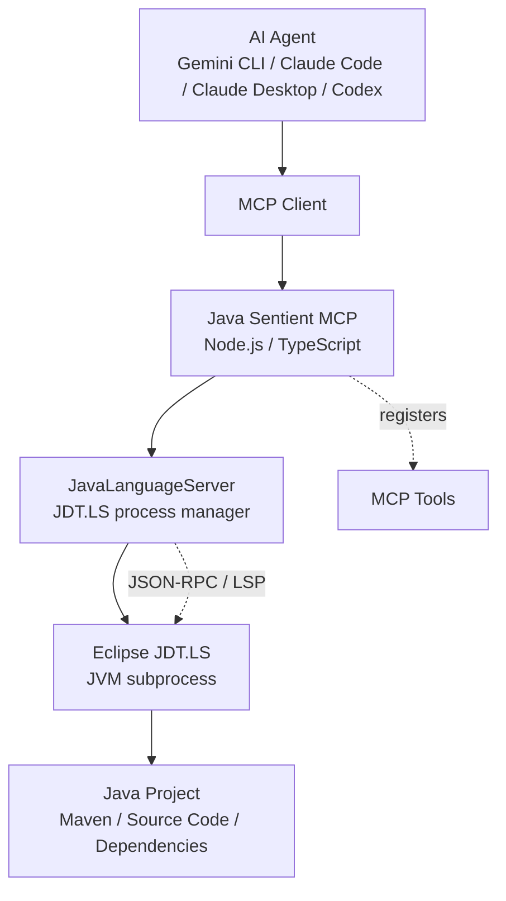

# Java Sentient MCP 项目介绍

## 项目概述

Java Sentient MCP 是一个面向 AI Agent 的 Java 代码智能桥接服务。它通过 Model Context Protocol (MCP) 将 Gemini CLI、Claude Code、Claude Desktop、Codex 等 AI 编码工具连接到 Eclipse JDT.LS，让 AI 在处理 Java 项目时具备接近 IDE 的代码理解能力。

简单来说，本项目把 Eclipse JDT.LS 的 Java 语言服务能力封装成 MCP 工具，使 AI Agent 可以执行定义跳转、引用查找、Hover 信息读取、全局符号搜索、Maven 项目加载、实时诊断等操作，从而更可靠地理解和修改 Java 代码库。

## 解决的问题

AI Agent 仅依靠文本搜索和文件读取，很难准确理解复杂 Java 项目的符号关系、依赖关系和编译状态。尤其在大型 Maven 项目中，类路径、外部依赖、重载方法、继承关系和跨文件引用都会影响代码修改的正确性。

Java Sentient MCP 的定位是成为 AI Agent 与 Java 工程之间的语言智能层。它不重新实现 Java 解析器，而是复用成熟的 Eclipse JDT.LS，将专业的 Java Language Server 能力通过 MCP 标准接口暴露给上层 AI 工具。

## 核心能力

| 能力 | 说明 |
| --- | --- |
| MCP Server | 基于 `@modelcontextprotocol/sdk` 暴露标准 MCP 工具，支持通过 stdio 与客户端通信。 |
| Gemini CLI Extension | 通过 `gemini-extension.json` 提供 Gemini CLI 扩展集成方式。 |
| 原生 JDT.LS 启动 | 直接通过 JVM 启动 Eclipse JDT.LS，并使用 JSON-RPC 与其通信。 |
| Maven 项目加载 | 支持将 Maven 项目加入工作区，触发依赖解析和符号索引。 |
| Java 代码导航 | 支持定义跳转、引用查找、Hover 信息、全局符号搜索和文件符号提取。 |
| 实时代码诊断 | 支持获取文件级和工作区级错误、警告等诊断信息。 |
| 外部源码读取 | 支持读取 `jdt://`、`jrt://` 等 URI 对应的类文件或 JDK 源码内容。 |
| 多项目实例隔离 | 基于工作区路径哈希生成独立 JDT.LS 数据目录，避免项目之间互相污染。 |
| Agent Skills | 提供 Java 生命周期、项目加载、代码导航、代码验证等 AI 工作流说明。 |

## 系统架构



核心代码由两部分组成：

| 文件 | 职责 |
| --- | --- |
| `src/index.ts` | MCP Server 入口，负责注册工具、解析参数、处理 MCP 请求和环境变量。 |
| `src/language-server.ts` | JDT.LS 管理层，负责启动 JVM 子进程、建立 JSON-RPC 连接、发送 LSP 请求并缓存诊断结果。 |

## MCP 工具列表

项目当前向 AI Agent 暴露以下工具：

| 工具 | 作用 |
| --- | --- |
| `java_start` | 启动 Java Language Server。 |
| `java_restart` | 重启 Java Language Server。 |
| `java_get_status` | 查看当前服务状态和工作区路径。 |
| `configure_jdt_ls` | 动态更新 JDT.LS 配置。 |
| `java_load_maven_project` | 加载 Maven 项目并触发索引。 |
| `java_search_symbols` | 在工作区中搜索类、方法、字段等符号。 |
| `java_get_file_symbols` | 获取单个 Java 文件中的符号结构。 |
| `java_open_file` | 将文件内容同步给 JDT.LS，触发诊断。 |
| `java_get_diagnostics` | 获取指定文件的错误和警告。 |
| `java_get_workspace_diagnostics` | 获取整个工作区的诊断信息。 |
| `java_get_definition` | 获取符号定义位置。 |
| `java_get_references` | 获取符号引用位置。 |
| `java_get_hover` | 获取符号类型、签名或文档信息。 |
| `find_references` | 增强版引用查找，会标注外部库引用结果。 |
| `read_java_content` | 读取本地文件、外部库源码或 JDK 类内容。 |

## Agent Skills

`skills/` 目录提供面向 AI Agent 的工作流文档，用来约束和优化 AI 使用 Java 语言服务的方式。

| Skill | 文件 | 作用 |
| --- | --- | --- |
| Java Server Lifecycle | `skills/java-lifecycle/SKILL.md` | 管理 JDT.LS 启动、状态检查和重启流程。 |
| Java Project Load | `skills/java-project-load/SKILL.md` | 指导 AI 优先加载 Maven 项目并等待索引完成。 |
| Java Code Navigation | `skills/java-navigation/SKILL.md` | 指导 AI 使用符号搜索、定义跳转和引用查找理解代码。 |
| Java Code Verification | `skills/java-verification/SKILL.md` | 指导 AI 在修改 Java 文件后同步内容并读取诊断结果。 |

这些 Skill 的价值在于让 AI 少做低效的全文扫描，更多依赖语言服务器返回的结构化信息，从而提升分析准确度和修改稳定性。

## 项目结构

```text
Java-Sentient-MCP/
├── src/
│   ├── index.ts                 # MCP Server 入口和工具注册
│   └── language-server.ts       # JDT.LS 启动、连接、LSP 请求封装
├── dist/                        # TypeScript 编译输出
├── skills/                      # 面向 AI Agent 的技能说明
│   ├── java-lifecycle/
│   ├── java-navigation/
│   ├── java-project-load/
│   └── java-verification/
├── docs/                        # 文档目录
├── design/                      # 概要设计和详细设计文档
├── gemini-extension.json        # Gemini CLI 扩展配置
├── GEMINI.md                    # Gemini Agent 行为规则
├── package.json                 # Node.js 项目配置
├── tsconfig.json                # TypeScript 编译配置
└── README.md                    # 项目说明
```

## 技术栈

| 类型 | 技术 |
| --- | --- |
| 开发语言 | TypeScript |
| 运行环境 | Node.js 18+ |
| 模块系统 | ESM / NodeNext |
| MCP 协议 | `@modelcontextprotocol/sdk` |
| LSP 通信 | `vscode-jsonrpc`、`vscode-languageserver-protocol` |
| Java 语言服务 | Eclipse JDT.LS |
| 配置加载 | `dotenv` |
| 参数校验 | `zod` |
| 构建工具 | TypeScript Compiler (`tsc`) |

## 环境要求

使用本项目需要准备以下环境：

| 依赖 | 要求 |
| --- | --- |
| Node.js | 18.0.0 或更高版本 |
| JDK | Java 17 或更高版本，推荐 Java 21+ |
| Eclipse JDT.LS | 需要单独下载并配置安装目录 |
| Maven | 用于 Maven 项目依赖解析，建议安装 |

常用环境变量如下：

| 变量 | 说明 | 是否必需 |
| --- | --- | --- |
| `JDTLS_HOME` | Eclipse JDT.LS 安装根目录 | 是 |
| `JDTLS_JAVA_HOME` | 启动 JDT.LS 使用的 JDK 路径 | 否 |
| `JAVA_WORKSPACE_PATH` | Java 项目工作区路径，默认使用当前目录 | 否 |
| `JDTLS_JAVA_RUNTIMES` | 多版本 JDK 运行时配置，JSON 数组格式 | 否 |
| `JDTLS_MAVEN_USER_SETTINGS` | Maven 用户级 `settings.xml` 路径 | 否 |
| `JDTLS_MAVEN_GLOBAL_SETTINGS` | Maven 全局 `settings.xml` 路径 | 否 |
| `JDTLS_MAVEN_OFFLINE` | 是否启用 Maven 离线模式 | 否 |
| `JAVA_PROJECT` | 标记当前工作区为 Java 项目，可用于自动启动 | 否 |

## 快速上手

安装依赖并构建项目：

```bash
npm install
npm run build
```

作为 Gemini CLI 扩展安装：

```bash
gemini extensions install .
```

作为 MCP Server 接入其他客户端时，可以在客户端配置中指向构建后的入口文件：

```json
{
  "mcpServers": {
    "java-mcp-server": {
      "command": "node",
      "args": [
        "/absolute/path/to/Java-Sentient-MCP/dist/index.js"
      ],
      "env": {
        "JDTLS_HOME": "D:/software/jdt-language-server-latest",
        "JDTLS_JAVA_HOME": "D:/software/java/jdk-21",
        "JDTLS_JAVA_RUNTIMES": "[{\"name\":\"JavaSE-17\",\"path\":\"D:/software/jdk-17\"}]"
      }
    }
  }
}
```

## 典型使用场景

- AI 辅助维护 Java 项目时，通过语言服务准确定位类、方法和引用关系。
- AI 修改 Java 文件后，实时获取编译错误和警告，形成“修改、诊断、修复”的闭环。
- 在大型 Maven 项目中，让 AI 先加载项目并建立索引，再进行跨文件分析。
- 让 Claude Code、Gemini CLI、Codex 等工具具备更接近 IDE 的 Java 代码理解能力。
- 读取外部依赖或 JDK 类的源码内容，辅助分析第三方 API 使用方式。

## 设计亮点

1. 直接启动 JDT.LS JVM 子进程，避免额外包装层带来的通信不确定性。
2. MCP 请求与 LSP 请求职责分离，`index.ts` 关注工具协议，`language-server.ts` 关注语言服务。
3. 工作区数据目录按路径哈希隔离，适合多 Java 项目并行使用。
4. 启动 JDT.LS 前清理 `PORT`、`CLIENT_PORT` 等变量，避免外部工具干扰 JDT.LS 通信模式。
5. 诊断获取同时支持主动拉取和异步发布缓存，提高不同 JDT.LS 版本下的兼容性。
6. 通过 Skill 文档沉淀 AI 使用规范，让 Agent 更稳定地调用工具完成 Java 任务。

## 相关文档

- `README.md`: 英文项目说明。
- `docs/README_zh.md`: 中文 README。
- `简介.md`: 简短项目介绍。
- `项目详细介绍.md`: 更完整的项目背景和设计说明。
- `design/TD-D-01_概要设计说明书.md`: 概要设计文档。
- `design/TD-D-02_详细设计说明书.md`: 详细设计文档。

## 许可证说明

当前 `package.json` 中标注的许可证为 `ISC`，但仓库根目录 `LICENSE` 文件内容为 GPL-3.0 文本。正式发布或对外分发前，建议统一许可证声明，避免使用者产生误解。
